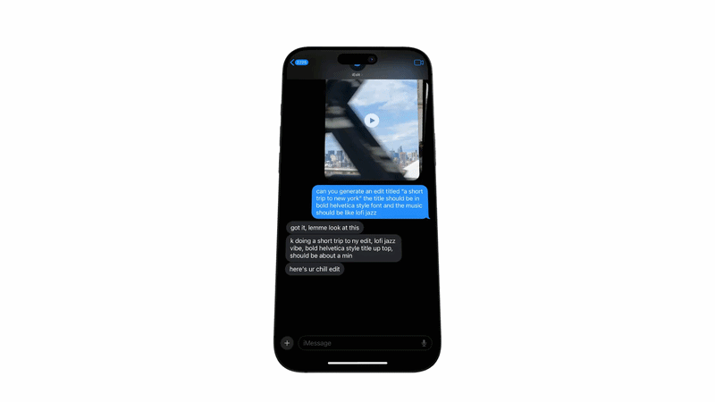
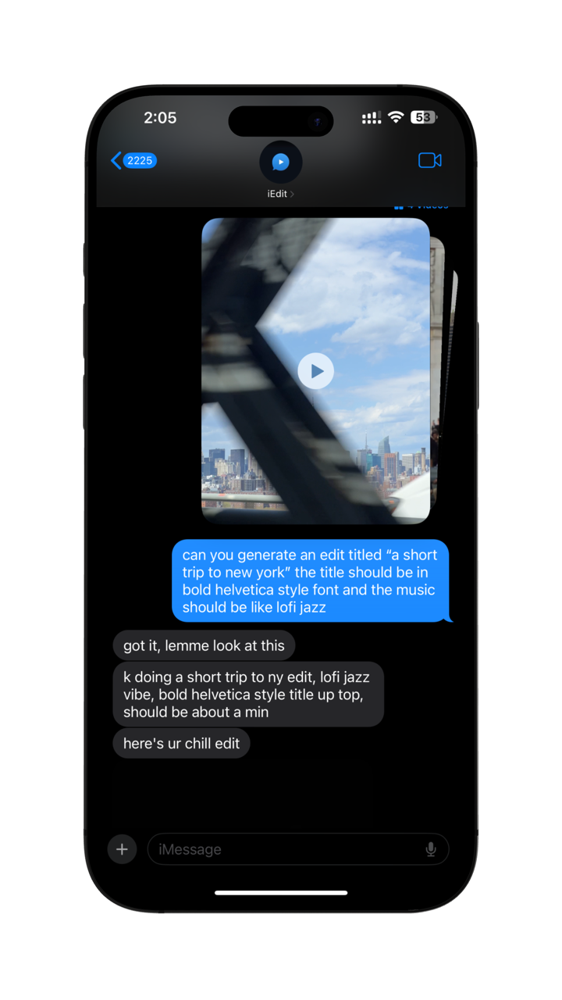
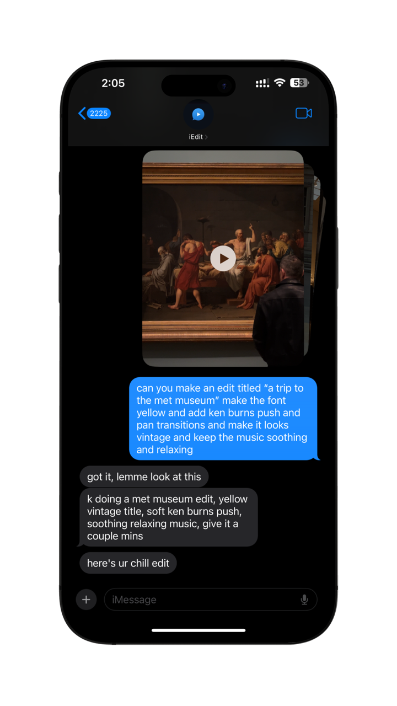
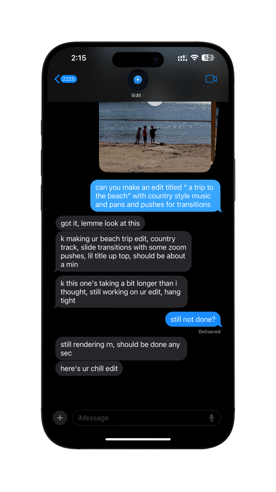
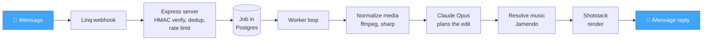
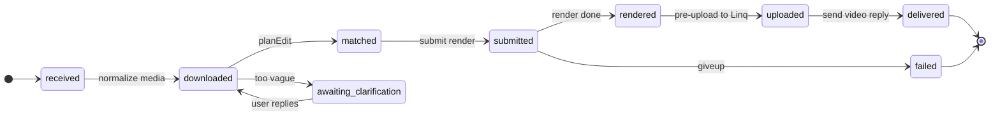

<p align="center">
  
</p>

<h1 align="center">iEdit</h1>

<p align="center">
  <b>An AI video editor that lives in iMessage.</b><br/>
  Text it a few clips and a caption. It picks the cut, the music, the text
  overlays, and the color grade, then texts you back the finished video.
</p>

<p align="center">
  
  
  
  
  
  
  <a href="https://iedit.dev"></a>
</p>

<p align="center">
  
</p>

> *"christmas edit with bold text"* becomes a festive montage with the real
> "Jingle Bells" and red uppercase overlays.
>
> *"slow mo cinematic black and white"* becomes a 0.5x slowed clip, dramatic
> grade, greyscale, moody score, slow push in.
>
> *"recap of my trip from these pics"* becomes snappy carousel cuts with a slow
> zoom on each photo and a chill summer track.
>
> Send a video with no caption and it asks back "what's the vibe? hype, chill,
> sad?"

It's a take home project, but it's deployed and runs end to end. Text the number
below to try it on your own clips.

## 📱 Try it on your iPhone

<div align="center">

<a href="sms:+16504687059?body=hi"></a>

<br/>


<br/>

<sub>Tap on iPhone or Mac to open Messages to <b>+1&nbsp;(650)&nbsp;468&#8209;7059</b> with <code>hi</code> already typed. On desktop, scan the QR with your phone. <i>(Demo line, may rotate.)</i></sub>

</div>

1. Send the prefilled <code>hi</code> to start the chat (or text anything).
2. It replies asking you to reply `OK` to opt in (one time). You get a quick
   rundown plus an "Add to Contacts" card.
3. Send one or more video clips and photos in a single message, with a caption
   describing the vibe you want. Things like *"hype gym edit with big bold
   text"*, *"chill summer recap, slow mo"*, or *"make it cinematic"*.
4. You get an instant `got it, lemme look at this`, then a confirmation of what
   it's making with a rough wait time, then the finished video.
5. You can also chat with it normally. Ask *"how's my video coming?"*, *"what
   styles can you do?"*, or text a tweak like *"swap the music to jazz"* or
   *"use the Bebas Neue font"*.

### Demo limits

It's a demo, so it's capped. 50 edits per person per day, at least 60 seconds
between edits, and around 200 edits per day across everyone. Music comes from
Jamendo (royalty free), so famous tracks aren't available. For themes like
Christmas it falls back to public domain pieces (carols, classical). Fonts
cover almost all of Google Fonts but not proprietary ones (Helvetica, Arial,
Times), which map to the nearest open license match.

### What it understands

| | |
|---|---|
| **Styles** | hype, sad, chill, funny, cinematic. The rendering scaffold. |
| **Music** | Matched to the mood by genre, tempo, and instrumentation. Royalty free, with curated tracks pinned for iconic themes (christmas plays the real Jingle Bells). Asking for *"something like Eye of the Tiger"* gets you driving motivational rock. |
| **Pacing** | Cuts per minute. *"fast paced"* gives you rapid cuts; *"let it breathe"* gives you slow lingering shots. |
| **Speed** | Slow motion or sped up, applied to single clips. |
| **Color** | Vibrant, muted, vintage, black and white, dramatic. |
| **Transitions** | Hard cut (default), fade, zoom, slide, carousel (the recap reel look), wipe. |
| **Motion** | A slow Ken Burns push or pan on the clips. Great for photo slideshows so stills don't sit frozen. |
| **Text overlays** | Content, position, color, all caps, a colored pill behind it, in and out animation, any open license font by name (Bebas Neue, Lobster, Pacifico, Anton, anything on Google Fonts), size, outline. |
| **Multi turn** | Refine a delivered edit by texting a tweak. It re-renders from the clips it already has and applies only what changed. |
| **Edge cases** | Asks one clarifying question if a request is too vague. Friendly failure messages, never silent. Per sender and system wide rate limits. |

## 🎬 Examples

A few real edits from the demo number, paired with the texts that produced them.

<table>
  <tr>
    <th width="50%">What I texted</th>
    <th width="50%">What it sent back</th>
  </tr>
  <tr>
    <td align="center"></td>
    <td align="center">
      <video src="https://github.com/user-attachments/assets/70c81410-0d75-4c32-b619-e6a76096280e" width="280" autoplay loop muted playsinline></video>
      <br/><sub><i>lofi jazz, bold helvetica title up top</i></sub>
    </td>
  </tr>
  <tr>
    <td align="center"></td>
    <td align="center">
      <video src="https://github.com/user-attachments/assets/af80ca0e-c101-4a63-b114-1170ce12d3e1" width="280" autoplay loop muted playsinline></video>
      <br/><sub><i>vintage look, yellow title, soft ken burns push, soothing music</i></sub>
    </td>
  </tr>
  <tr>
    <td align="center"></td>
    <td align="center">
      <video src="https://github.com/user-attachments/assets/db28f0d8-7f3b-4bea-a14b-7ae2a7cdbe0f" width="280" autoplay loop muted playsinline></video>
      <br/><sub><i>country track, slide transitions with zoom pushes, small title</i></sub>
    </td>
  </tr>
</table>

## 🧠 How it works



A user's iMessage lands on a Linq virtual number, which posts a signed webhook
to this app. The webhook verifies the HMAC, dedups on the event id, runs
access and rate limit checks, creates a `Job` row, and returns `200`
immediately. A background worker (a 1 second `setInterval` loop with an atomic
`SELECT ... FOR UPDATE SKIP LOCKED` claim) walks the job through a state
machine, persisting after every transition so a crash or redeploy resumes
cleanly.

### The matcher

`src/services/match.ts` (`planEdit`) is the brain. It takes the caption plus
the clip count, and on a re-run a tweak request, and returns a structured
`EditPlan` from Claude Opus.

| Field | What it controls |
|---|---|
| `confirmation` | The casual line texted back (*"doing a fast hype gym edit, hard rock, big bold text"*). |
| `needs_clarification`, `clarification_question` | Set only when the request is genuinely too vague. |
| `style` | `hype`, `sad`, `chill`, `funny`, `cinematic`. |
| `music` | A `MusicSpec` with `tags`, `freetext`, `tempo`, `acoustic_or_electric`. Claude picks the search params. |
| `keep_original_audio` | Keep the source audio (ducked) instead of muting it under the music. |
| `pace` | `very_fast`, `fast`, `medium`, `slow`, `very_slow`. Cuts per minute in a montage. |
| `speed` | `slow` (~0.5x), `normal`, `fast`. Single clip edits only. |
| `color_filter` | `none`, `vibrant`, `muted`, `bw`, `dramatic`. |
| `transition` | `cut`, `fade`, `zoom`, `slide`, `carousel`, `wipe`. |
| `motion` | `none`, `zoom`, `pan`. Slow Ken Burns move on the clips. |
| `text_overlays[]` | `text`, `position`, `color`, `uppercase`, `background`, `animation`, `font_name` (any Google Font, or `""`), `font` (fallback category), `size`, `outline`. |

The prompt nudges Claude to read the vibe boldly: gym means hard rock with
fast cuts and bold text, *"fast paced"* means more cuts per minute,
*"romantic"* means slower with softer music, *"funny"* means playful (not
rock or epic), christmas means christmas music with festive text. It also
keeps the model from over styling, so it doesn't pile on fades, filters, or
slow motion the user didn't ask for. If the request really is undirected it
asks one clarifying question and parks the job. The large system prompt is
sent with `cache_control: ephemeral`.

### Refinement (multi turn)

After a delivered edit, a text follow up that reads as a tweak (*"make the
text yellow"*, *"use the Lobster font"*, *"different music"*, *"faster"*)
spins up a new render that reuses the already normalized clips on R2. No
resend, no re-transcode. The matcher returns the prior plan with only that
change applied. If it can't apply the ask (a proprietary font, an intro card
the renderer doesn't support), it says so honestly instead of silently
re-rendering an identical video.

### Music

`src/services/music.ts` resolves the `MusicSpec` against Jamendo. Iconic
themes use a hand curated track id (christmas pins the real "Jingle Bells";
halloween, summer, and romantic are also pinned). Everything else goes
through a tag driven ladder: `tags=<all>` first, then just the genre tag,
then `fuzzytags`. Jamendo's loose free text `search` is only a last resort.
Each level pulls a candidate pool and picks one at random for variety. The
chosen track gets re-hosted on R2 so Shotstack can fetch it reliably (Jamendo
audio URLs expire).

### Rendering

`src/templates/index.ts` (`buildEdit`) translates the `EditPlan` into a
Shotstack edit (timeline JSON). Montage timing comes from `pace`. The music
track plays over muted (or ducked) source audio. Text overlays render as
wrapping HTML assets, with Google Fonts loaded via `@font-face`, optional
colored pill, optional stroke. The color filter, the transition, and a per
clip Ken Burns `effect` get applied when set. Output size is clamped to fit
Shotstack's plan limit.

If a render is rejected, the worker retries once with a stripped down "safe"
edit (transitions reset to cut, no clip motion, no overlay backgrounds or
animations) before giving up. Renders that drag get a *"still cooking"*
message at about `estimate + 2 min`, a silent resubmit at `+ 4 min`, and a
giveup at `+ 9 min`.

### Media normalization

`src/services/transcode.ts` normalizes every uploaded clip before Shotstack
sees it. ffmpeg bakes iPhone rotation into the pixels, transcodes HEVC to
H.264, and caps the long side at 1920 pixels. Images (including HEIC, via
`sharp`) get auto rotated from EXIF and looped into a short clip. Clips are
processed one at a time, because parallel ffmpeg thrashes the single CPU
core.

### Access control

`src/services/access.ts` runs first use opt in (reply `OK`), per sender video
limits, a system wide daily budget, and an allowlist (the dev's test phone)
that skips the per minute limit. The webhook dedups on the Linq event id so
retries don't double count.

### State machine

State names are past tense. Each describes what's done.



**Chat (text only):** `received → replied`. Claude Sonnet replies using
recent chat history and the sender's most recent video job status. Or, if the
text reads as a tweak of a delivered edit, it spawns a refinement video job
instead.

**Terminal states:** `delivered`, `replied`, `failed`. On any failure the
user gets a friendly message. Nothing fails silently.

### Robustness

Every outbound HTTP call has a timeout, so a hung connection can't freeze the
single threaded worker. A watchdog exits the process if a tick wedges, Render
restarts it, and the boot sweep releases stale claims. `GET /version` returns
the running git SHA, so you can confirm which build is deployed.

For the per state breakdown and conventions see [`CLAUDE.md`](./CLAUDE.md).
For the original build narrative see [`BUILD_GUIDE.md`](./BUILD_GUIDE.md).

## 🛠 Tech stack

TypeScript (ESM) on Node 20+. Express for the HTTP surface. Prisma and
Postgres for storage. Zod validates every I/O boundary. Pino does the
logging. `@anthropic-ai/sdk` runs three Claude models: Opus 4.7 for
`planEdit`, Sonnet 4.6 for the chatbot, and Haiku for a tweak classifier.
Structured outputs flow through `output_config` and `zodOutputFormat`.
Shotstack handles rendering. `ffmpeg-static` and `sharp` handle media
normalization. Cloudflare R2 (S3 compatible) stores normalized clips and
music. Jamendo provides the music. The whole thing deploys to Render as a
single always on instance. There's no queue service; the worker loop and a
boot recovery sweep cover crashes.

## 🏃 Running it yourself

```bash
npm install                       # also runs `prisma generate`
cp .env.example .env              # fill in DATABASE_URL + ADMIN_SECRET (and API keys per integration)
npx prisma migrate dev            # apply migrations to your local Postgres
npm run dev                       # tsx watch src/index.ts
```

Then:

```bash
curl localhost:3000/healthz
curl localhost:3000/version                                          # git SHA of the running build
curl -H "Authorization: Bearer $ADMIN_SECRET" localhost:3000/admin/jobs
```

Without the external API keys you can still boot the server and exercise the
HTTP surface. The integrations no-op or fall back until their keys are set.

Scripts: `npm run typecheck`, `npm run build` (outputs to `dist/`),
`npm start`, `npx prisma migrate dev --name <name>`.

**Env vars.** `DATABASE_URL` and `ADMIN_SECRET` are required. The rest are per
integration: `LINQ_API_KEY`, `LINQ_WEBHOOK_SECRET`, `LINQ_NUMBER`,
`SHOTSTACK_API_KEY`, `SHOTSTACK_ENV` (defaults to `stage`; set `v1` for
production renders with no watermark and higher resolution),
`ANTHROPIC_API_KEY`, the five `R2_*` keys, `JAMENDO_CLIENT_ID`, and
`ACCESS_ALLOWLIST` (optional). See `.env.example`.

## 📁 Project layout

```
src/
  index.ts        Entry point. Express + worker + boot recovery sweep.
  webhook.ts      POST /webhook. HMAC verify, dedup, access check, clarification/refinement routing, create Job, 200 fast.
  admin.ts        GET /healthz, GET /version, GET /admin/jobs[/:id], GET /admin/contact-card (Bearer ADMIN_SECRET).
  worker.ts       1s tick: claim a job, advance(), persist. Plus recovery sweep, watchdog, failure notifications.
  state.ts        advance(job). The state machine (advanceVideoJob, advanceChatJob). Refinement, render timeouts and retries.
  schemas.ts      Zod schemas: LinqWebhookPayload, EditPlan, MusicSpec, ...
  http.ts         fetchWithTimeout. All outbound HTTP goes through this.
  version.ts      Git SHA resolution (RENDER_GIT_COMMIT, with a local fallback).
  services/
    match.ts          planEdit. The mastermind matcher and its cached prompt.
    music.ts          resolveMusicUrl. Jamendo tag ladder and curated tracks.
    transcode.ts      ffmpeg and sharp media normalization.
    media.ts          downloadMedia. Normalize and upload to R2.
    shotstack.ts      submitRender, pollRender.
    linq.ts           Outbound Linq: send text and video replies, upload attachments, typing indicator, share contact card.
    access.ts         checkAccess. Opt in, rate limits, daily budget.
    chat.ts           The chatbot reply and the tweak classifier.
    contact-card.ts   Sets up the Linq contact card (name plus logo) on boot.
  templates/index.ts  STYLE_PRESETS, PACE_TO_CLIP_SECONDS, FONT_SPECS, buildEdit. EditPlan to Shotstack edit JSON.
prisma/schema.prisma  Job and Sender models.
render.yaml           Render Blueprint.
```

ESM/NodeNext rule: relative imports end in `.js` even though the source is
`.ts`.

## 🚀 Deployment

`render.yaml` is a Render Blueprint. Connect the repo, paste the secret env
vars once, and it auto deploys on push to `main` (`buildCommand: npm install
--include=dev && npm run build`, `startCommand: npx prisma migrate deploy
&& npm start`). Live at `https://linq-video-editor.onrender.com`
(`/healthz`, `/version`). Set `SHOTSTACK_ENV=v1` once you have Shotstack
credits. Production renders have no watermark, a higher resolution cap, and
no rate limits.

## Known limitations

* Royalty free music only. No famous or copyrighted tracks. The matcher names
  public domain equivalents for themes (Christmas carols, classical pieces).
  Tag based matching is good for common cases but not perfect.
* `speed` (slow motion) applies to single clip edits only. Multi clip trim
  math gets fiddly.
* Source audio is all or nothing (muted, or kept and ducked to 0.3). No per
  clip audio control.
* Fonts cover almost all of Google Fonts by name via the `@fontsource` CDN,
  plus a five category fallback. Proprietary fonts (literal Helvetica,
  Arial, Times) can't legally be hosted, so those map to the nearest open
  license match. Wider per glyph control (stroke widths, gradients) would
  mean switching overlays to Shotstack's `text` asset.
* Heavy transcoding (4K to 1080p, for example) is CPU bound on a single
  core, so very long source clips add latency. There's a 150MB input size
  cap as a guard.
* Demo runs on Shotstack's free `stage` env until `SHOTSTACK_ENV=v1` is set.
  That env watermarks output and caps resolution at 1080p.

## Contact

Website: [iedit.dev](https://iedit.dev) · Email: [rayid@iedit.dev](mailto:rayid@iedit.dev)
